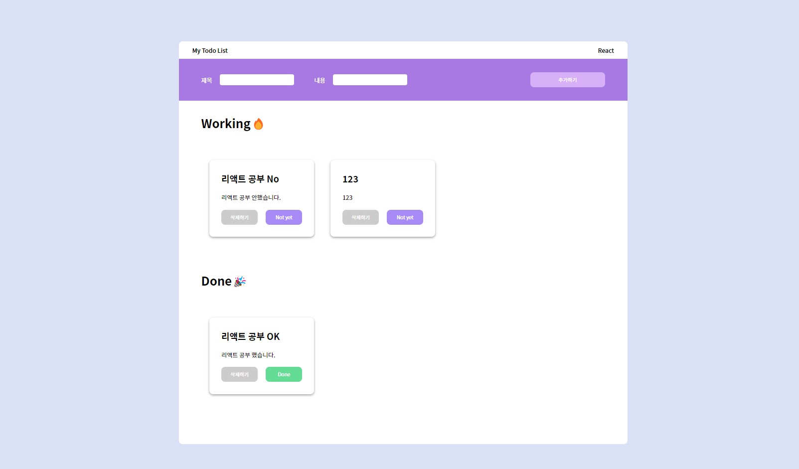
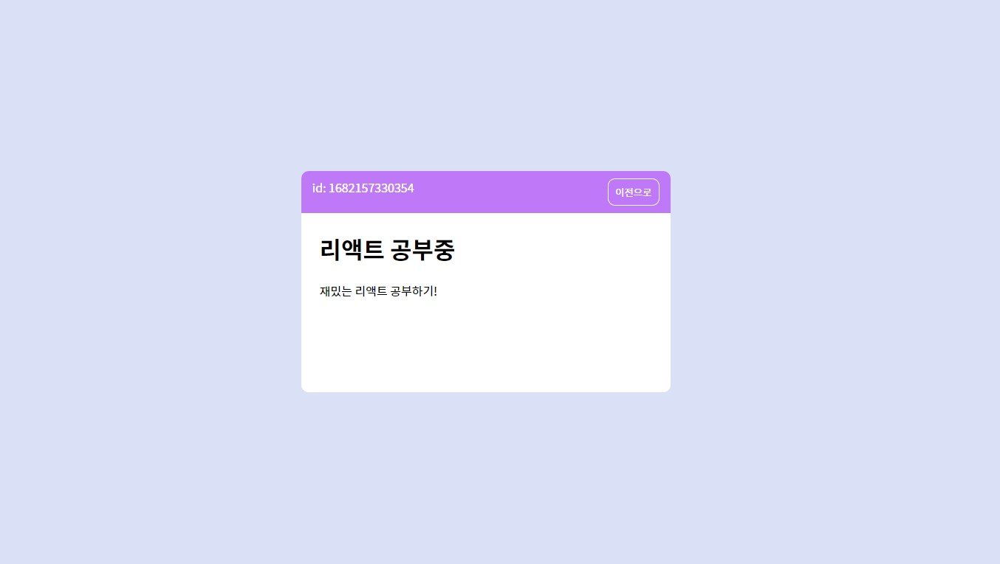

## 📒 리액트 TODO-LIST

#### 1. 프로젝트 Description

TODO-LIST에서 Redux로 전역 상태관리하기. 동적 라우팅을 이용해 상세페이지 라우팅하고 모달창 생성하기

App 보러가기 : https://react-redux-todo-list-eight.vercel.app/

##### TODO-LIST 화면 이미지

## 

## 

#### 2. Redux 전역 상태관리

- 전역 state : todos

```javascript
const initialTodos = [
  {
    id: Date.now(),
    title: "리액트 공부중",
    text: "재밌는 리액트 공부하기!",
    isDone: false,
  },
];

export const todos = (state = initialTodos, action) => {
  switch (action.type) {
    case ADD_TODO:
      return [...state, action.payload];
    case DELETE_TODO:
      const deletedTodos = state.filter((todo) => todo.id !== action.payload);
      return deletedTodos;
    case TOGGLE_CHANGE:
      const changedTodos = state.map((todo) => {
        if (todo.id === action.payload) {
          return {
            ...todo,
            isDone: !todo.isDone,
          };
        }
        return todo;
      });
      return changedTodos;
    default:
      return initialTodos;
  }
};
```

- action creator 함수

```javascript
export const addTodo = (payload) => {
  return {
    type: ADD_TODO,
    payload,
  };
};

export const deleteTodo = (payload) => {
  return {
    type: DELETE_TODO,
    payload,
  };
};

export const doneToggleChange = (payload) => {
  return {
    type: TOGGLE_CHANGE,
    payload,
  };
};
```

#### 3. Routing : 동적 라우팅

```javascript
function Router() {
  return (
    <BrowserRouter>
      <Routes>
        <Route path="/" Component={TodoListPage}></Route>
        <Route path="/:id" Component={DetailPage}></Route>
      </Routes>
    </BrowserRouter>
  );
}
```

#### 4. 컴포넌트 구조 설계 : 재사용성과 확장성을 고려하여 컴포넌트화가 필요한 부분 컴포넌트로 구성

- InputBar 컴포넌트 : todo 입력을 받는 Bar 컴포넌트 입니다.

- Input 컴포넌트 : 내용을 입력받는 input을 재사용하기 위해 컴포넌트화 하였습니다.

- Button 컴포넌트 : button을 재사용하기 위해 컴포넌트화 하였습니다.

- TodoList 컴포넌트 : todo를 보여주는 list 컴포넌트 입니다.

- Todo 컴포넌트 : todo카드의 내용을 보여주는 컴포넌트 입니다.
